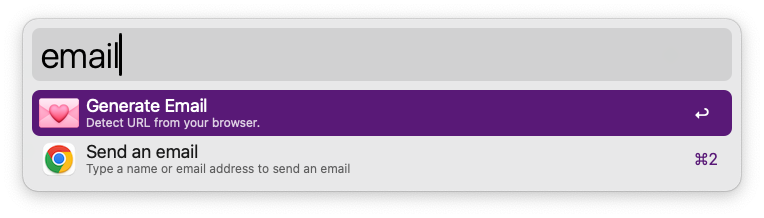
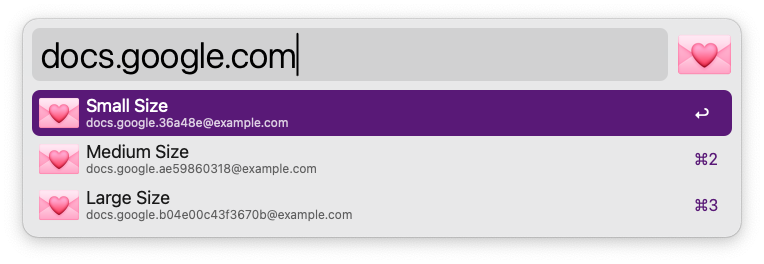
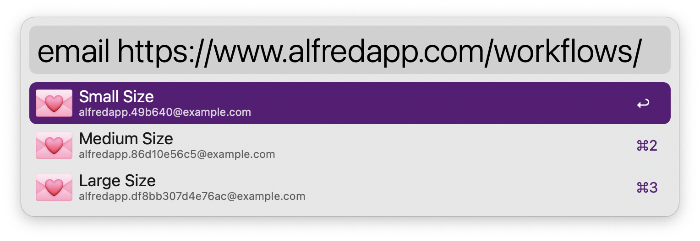

## 💌 Email Generator

This package is used to generate unique email addresses for wildcard domains based on an input text and some random hashes.

### Automatically Detecting the URL

Assuming the top most browser has the URL loaded, the plugin can detect it for you by actioning the base command.

`> email` && `<enter>`

This will pre-fill in the `Manually Entering the URL` action below

### Manually Entering the URL

`> email google.com`

Will give you 3 size email addresses:

*  google.3b0094@example.com
*  google.672667003b@example.com
*  google.6dc6da300a6526a@example.com

You can pass in

* Name of a website like `google`
* Full or partial domains `calendar.google.com`
* Full URL `https://docs.google.com/spreadsheets/d/1SAAAk0A_kO4CAAAp-rcpwlRC7AAAAq3qwrIldc/edit#gid=1940831276`

## Installing

* Download the latest [release](https://github.com/mxbaylee/email-generator/releases).
* Be sure to set the `domain` value.
    * Click "Configure Workflow..."
    * Update `domain` with your wildcard domain name.
